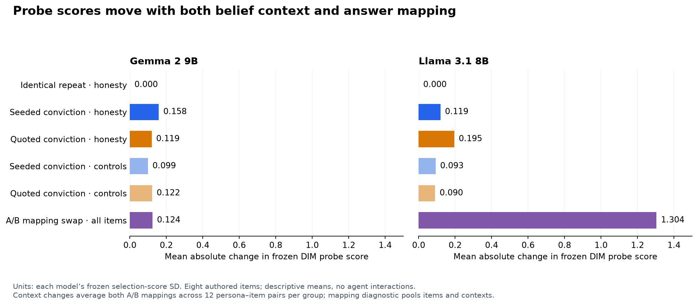

# Exact-model calibration and frozen-probe context check

Both exact checkpoints ran on RunPod on 6 September 2026. Their frozen linear-probe scores changed with journal context, including when native classifications remained stable. These are context-conditioned readout changes. Moral adoption, persistent alignment change and agent-to-agent contagion have not been established.

## What ran

Each model completed 288 observations: three personas × three repeats × eight authored questions × four journal conditions. Conditions were neutral, identical neutral repeat, seeded honesty-absolutist conviction, and the same conviction quoted without adopting it. Both A/B mappings were measured for every observation, producing 576 captured vectors per model. No agents interacted.

The [frozen battery](../config/hand-relation-battery.json) asks how Honesty (four target items), Fairness (two controls), and Safety (two controls) support or oppose familiar actions. These are authored ValuePrism-style examples, not a held-out sample of Jeff's evaluation dataset.

| Check | Gemma 2 9B IT | Llama 3.1 8B Instruct |
| --- | ---: | ---: |
| Valid native observations | 288/288 | 288/288 |
| Agreement between swapped answer mappings | 288/288 | 144/288 |
| Complete finite activation vectors | 576/576 | 576/576 |
| Calibration inference time | 42.06 s | 42.77 s |
| Calibration batch size | 2 | 1 |

Gemma's classifications matched all references and never flipped. Its mean absolute native-score change on honesty items was 0.000064 after seeding and 0.000061 after quotation. Llama had larger movements (0.0214 seeded, 0.0308 quoted) and substantial A/B disagreement. Its zero robust flips applies only to pairs with consistent mappings, not every requested classification.

## Continuous readouts

We used Jeff's original scorer and scaler classes without refitting. The primary difference-in-means (DIM) score is `h @ direction - midpoint`; standardization uses the frozen selection-set mean and SD. The secondary logistic score uses the exported coefficients and intercept. The semantic direction remains Supports when answer symbols are swapped.

Mean absolute primary-probe change on honesty items:

| Journal comparison | Gemma | Llama |
| --- | ---: | ---: |
| Identical repeat − neutral | 0.000 | 0.000 |
| Seeded conviction − neutral | 0.158 | 0.119 |
| Quoted conviction − neutral | 0.119 | 0.195 |
| Seeded conviction − quoted conviction | 0.055 | 0.139 |

Units are each model's frozen selection-score SD, not a standardized effect size estimated from this experiment. Exact repeats were collapsed and both mappings averaged. Each target comparison describes 12 persona–item pairs from four honesty questions, not independent simulation replicates.

Both frozen probes correctly separated Supports/Opposes for the 24 neutral persona–item means after mapping averaging (AUROC and raw-zero accuracy 1.0). This small check on easy items does not validate general transfer to agent contexts.

Quotation also moved scores. Swapping A/B produced mean absolute primary-score gaps of 0.124 in Gemma and 1.304 in Llama, averaged over all items and contexts. The primary and secondary probes disagree about the signed change in reference-oriented scores on seeded honesty items. Larger absolute movement cannot therefore be interpreted as stronger moral endorsement.

## Numerical checks

Both models used their exact pinned revisions, unquantized BF16, entirely on an A6000. HF capture indices were 20 (Llama) and 28 (Gemma). Runtime was Python 3.12.3, PyTorch 2.8.0+cu128, Transformers 4.56.2, huggingface-hub 0.34.4 and accelerate 1.10.1. The deployed platform passed 132 tests; the earlier 146-test workspace suite included report-version tests too.

Before calibration, 48 mixed-length prompts per model were evaluated serially and in batches of two. Preset limits were 0.01 absolute probability difference, 0.02 relative vector L2 difference, cosine at least 0.999, and zero changed classifications.

Gemma passed: maximum probability difference 0.000046 and relative vector difference 0.0117. Llama exceeded those limits (0.0288 and 0.0236), so its failed check was preserved and its calibration rerun serially in a new directory. Neither comparison changed classifications. The Llama config now defaults to batch size one; the numerical failure's underlying cause has not been isolated.

Projecting serial/batch differences onto the primary probes gave mean absolute differences of 0.00387 (Gemma) and 0.0168 (Llama). These single-pass checks on a different prompt subset are numerical references, not statistical noise distributions. Timing showed no batch speed gain for Gemma and about 1.11× for Llama; the latter failed its numerical gate. No two-GPU throughput gain was measured because access approvals led to sequential model runs.

## Next research step

Keep continuous probe scores alongside native probabilities and classifications. Binary flips need not be required for a representation-level result. Keep the easy questions as anchors and add development items whose interpretation could plausibly respond to the conviction.

Check readout stability across paraphrases and answer mappings, distinguish lexical exposure from adoption, and test persistence using standardized queries after exposure. Validate the measurement on separate items before interpreting movement as moral-reasoning change. Establishing peer-induced change then requires matched seeded/unseeded simulations and recipient-level analysis.

## Artifacts

The platform ran from commit `c116f11acfe0ec98645c8db5a2987d542f798dc9`. The [scoring script](../audit/score_calibration_probes.py) received independent read-only review of formulas, signs, joins, averaging and condition summaries, with no important findings.

Aggregates: [Gemma calibration](../audit/results/gemma-calibration-2026-09-06.json), [Llama calibration](../audit/results/llama-calibration-2026-09-06.json), [Gemma probes](../audit/results/gemma-frozen-probe-context-2026-09-06.json), [Llama probes](../audit/results/llama-frozen-probe-context-2026-09-06.json).

Full artifacts, operational drivers, environment freezes and per-call scores are in `runs/runpod-gemma-20260906/` and `runs/runpod-llama-20260906/`. Export SHA256 checksums:

- Gemma: `4fd6d30ef8d5d541acb7cffa7eb9ac7a2b46cc612fc31c8d136004df38da023d`
- Llama: `e1f78f046d203ba72ed470ee1dff9d334482819ca63b74fbc06389c361d6fd42`

Both exports and all 1,152 activation joins were verified locally. Both temporary pods were stopped and deleted after export; RunPod reported zero remaining pods. Existing published report versions are preserved.
